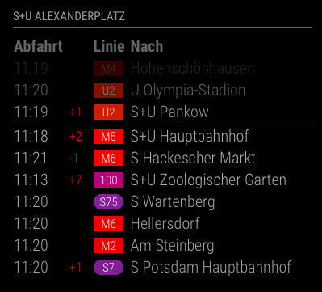

# MMM-PublicTransportBerlin

MMM-PublicTransportBerlin is a module for the [MagicMirror](https://github.com/MichMich/MagicMirror) project by 
[Michael Teeuw](https://github.com/MichMich).

It shows live public transport information for Berlin and Brandenburg based on [VBB-Hafas](http://www.hafas.de/company/referenzen/vbb) data.
Since it uses VBB data, the whole transport network is covered. So public transport in Brandenburg will work as well. 
MMM-PublicTransportBerlin uses the [vbb-hafas](https://github.com/derhuerst/vbb-hafas) REST API by [derhuerst](https://github.com/derhuerst).

*Notes:*
* *Currently, only departures of a station with all kinds of transportation (bus, tram, ferry, suburban, subway) are possible. 
I will add a filter function to choose between transportation kinds in the near future.*   
* *There hasn't been tests with all possible values yet. Some value combinations could lead to strange behaviour.*
* *Also, the fading for the reachable departures is not yet working properly.*

You can enter a delay time for "How long does it take to get to my station?". 
Then the module calculates the next reachable departures and draws a line between reachable and unreachable departures.

## Screenshot

The module looks like this:



## Installation

Just clone the module into your MagicMirror modules folder and execute `npm install` in the module directory:

```
git clone https://github.com/deg0nz/MMM-PublicTransportBerlin.git
cd MMM-PublicTransportBerlin
npm install
```

## How to get the `stationId`

You will need a `stationId` for your module. You can get it as described in the [vbb-rest API documentation](https://github.com/derhuerst/vbb-rest/blob/21930eb2442ecdc8888e70d024391be29264f33f/docs/index.md).    
This is a cURL example for getting all possible stations with the keyword "alexanderplatz":

```
curl 'https://transport.rest/stations?query=alexanderplatz'
```

The answer should contain one or more possible stations with valid station IDs.

## Configuration

The module quite configurable. These are the possible options:

|Option|Description|
|---|---|
|`name`|The name of the module instance (if you want multiple modules).<br><br>**Type:** `string`<br>|
|`stationId`|The ID of the station. How to get the ID for your station is described below.<br><br>**Type:** `integer` This value is **Required**.|
|`interval`|How often the module is updated. The value is given in seconds.<br><br>**Type:** `integer`<br>**Default value:** `120000 // 2 minutes`<br>|
|`hidden`|Visibility of the module.<br><br>**Type:** `boolean`<br>**Default vaule:** `false`|
|`delay`|How long does it take you to get from the mirror to the station? The value is given in minutes.<br><br>**Type:** `integer`<br>**Default vaule:** `10 // 10 minutes`|
|`departureMinutes`|For how many minutes in the future should departures be fetched? If `delay` is set > 0, then this time will be added to `now() + delay`. (This could be obsolete in future versions but is needed for now.)<br><br>**Type:** `integer`<br>**Default vaule:** `10`|
|`showColoredLineSymbols`|If you want the line coloured and shaped or text only.<br><br>**Type:** `boolean`<br>**Default vaule:** `true`|
|`useColorForRealtimeInfo`|Set colors for realtime information<br><br>**Type:** `boolean`<br>**Default vaule:** `true`|
|`showTableHeadersAsSymbols`|Show the table headers as text or symbols.<br><br>**Type:** `boolean`<br>**Default vaule:** `true`|
|`maxUnreachableDepartures`|How many unreachable departures should be shown. Only necessary, of you set `delay` > 0<br><br>**Type:** `integer`<br>**Default vaule:** `3`|
|`maxReachableDepartures`|How many unreachable departures should be shown.<br><br>**Type:** `integer`<br>**Default vaule:** `7`|
|`fadeUnreachableDepartures`|Activates/deactivates fading for unreachable departures.<br><br>**Type:** `boolean`<br>**Default vaule:** `true`|
|`fadeReachableDepartures`|Activates/deactivates fading for reachable departures.<br><br>**Type:** `boolean`<br>**Default vaule:** `true`|
|`fadePointForReachableDepartures`|Fading point for reachable departures.<br><br>**Type:** `float`<br>**Default vaule:** `0.5` <br>**Possible values:** `0.0 - 1.0`|

Here is an example of an entry in `config.js`:

``` JavaScript
{
    name: "Alexanderplatz",
    stationId: 9160003,
    hidden: false,
    delay: 10,
    interval: 120000,
    departureMinutes: 10,          
    maxDepartures: 15,              
    showColoredLineSymbols: true,  
    useColorForRealtimeInfo: true,
    showTableHeadersAsSymbols: true,
    maxUnreachableDepartures: 3,    
    maxReachableDepartures: 7,
    fadeUnreachableDepartures: true,
    fadeReachableDepartures: true,
    fadePointForReachableDepartures: 0.25
}
```

## Multiple Modules

Multiple instances of this module are possible. Just add another entry of the MMM-PublicTransportBerlin module to the `config.js` of your mirror.

## Special Thanks

* [Michael Teeuw](https://github.com/MichMich) for inspiring me and many others to build a MagicMirror.
* [Jannis Redmann](https://github.com/derhuerst) for creating the [vbb-hafas](https://github.com/derhuerst/vbb-hafas) REST API. 
You made my life a lot easier with this!
* The community of [magicmirror.builders](https://magicmirror.builders) for help in the development process.

## Issues

If you find any problems, bugs or have questions, please [open a GitHub issue](https://github.com/deg0nz/MMM-PublicTransportBerlin/issues) in this repository.